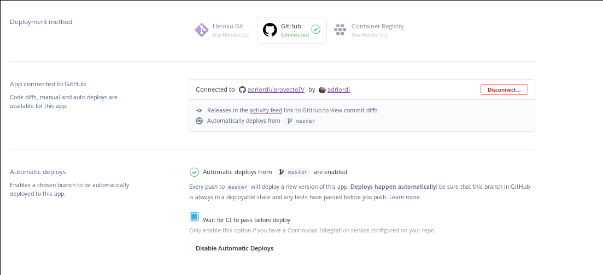
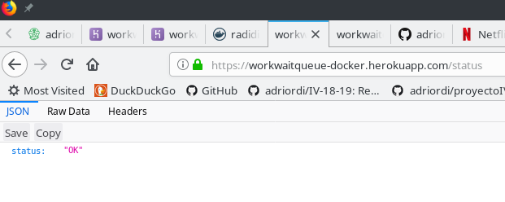
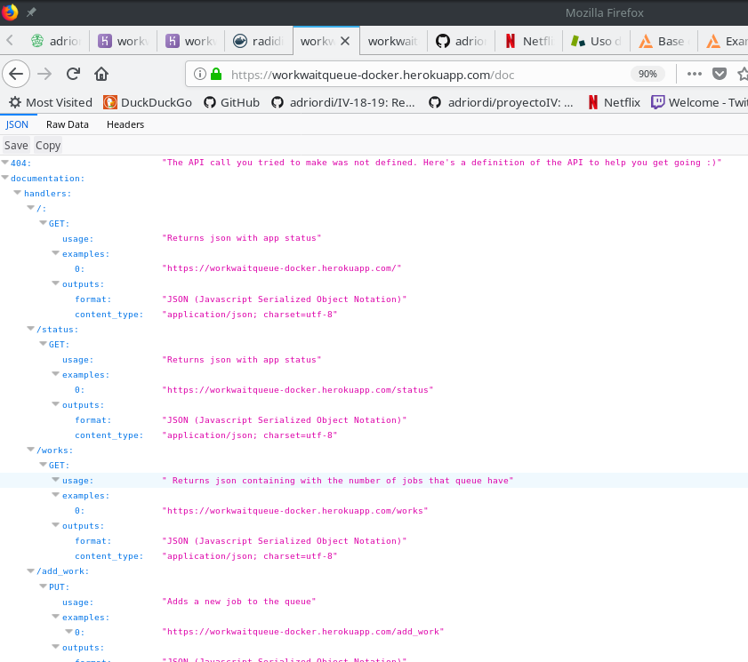

# Despliegue con Docker

## Creación de workwaitqueue-docker
Lo primero que hay que hacer es [crear una nueva applicación](https://github.com/adriordi/proyectoIV/blob/master/docs/DespliegueHeroku.md) en Heroku como hicimos en el hito anterior, en este caso, la he creado desde el propio navegador llamándola **workwaitqueue-docker**.

## Creación de heroku.yml
Una vez creada la applicación, debemos crear un archivo **heroku.yml** en la raíz de nuestro proyecto. Para ello vamos hacer uso del plugin "heroku-manifest", siguiendo estos pasos:

* Actualizamos nuestro cli de heroku a la beta e instalamos el plugin.
~~~~
$ heroku update beta
$ heroku plugins:install @heroku-cli/plugin-manifest
~~~~

* Creamos el manifiesto de nuestra applicación.
~~~~
$ heroku manifest:create
~~~~

* Subimos los cambios a GitHub.
~~~~
$ git add heroku.yml
$ git commit -m "Add heroku.yml"
~~~~

* Cambiamos la pila de heroku.
~~~~
$ heroku stack:set container
~~~~

* Pusheamos nuestra applicación a Heroku o, como en mi caso, lo sincronizamos con GitHub para que se despliegue cada vez que hacemos un push a nuestra branch master(foto de abajo).
~~~~
$ git push heroku master
~~~~

[Enlace a mi heroku.yml](https://github.com/adriordi/proyectoIV/blob/master/heroku.yml).

Toda la documentación que he seguido para realizar este apartado se en cuentra [aquí](https://devcenter.heroku.com/articles/buildpack-builds-heroku-yml#getting-started-existing-app)

## Despliegue del contenedor

Para el despliegue del contenedor nos hace falta un archivo Dockerfile, [enlace al mio](https://github.com/adriordi/proyectoIV/blob/master/Dockerfile), el cual cree basándome en el que encontre en la [documentación ofical de docker](https://docs.docker.com/get-started/part2/#dockerfile).

La imagen elegida es **python:3.6-slim**. Es una imagen que solo contiene los paquetes mínimos necesarios para ejecutar python, además tiene limitaciones de espacio, pero es suficiente para mi aplicación.

Esto se pone en la primera línea del Dockerfile.
~~~~
# Use an official Python runtime as a parent image
FROM python:3.6-slim
~~~~
En las siguiente, creamos el directorio de trabajo, en mi caso lo he llamado "wwq".
~~~~
# Set the working directory to /wwq
WORKDIR /wwq
~~~~

Copiamos en él solo lo necesario de nuestro proyecto, los archivos fuentes con los test, la api y los requirements para que todo funcione.
~~~~
# Copy the current directory contents into the container at /wwq
COPY ./src/ /wwq/src
COPY ./requirements.txt /wwq
COPY ./api_queue.py /wwq
~~~~

En la siguiente linea instalar los paquetes necesarios del requirements desde los hosts oficiales de Python.
~~~~
# Install any needed packages specified in requirements.txt
RUN pip install --trusted-host pypi.python.org -r requirements.txt
~~~~

Acto seguido debemos exponer el puerto del contenedor por el cual vamos a escuchar.
~~~~
# Make port 80 available to the world outside this container
EXPOSE 80
~~~~

Por último añadimos la linea para ejecutar la api en ese puerto respectivamente con gunicorn.
~~~~
# Run app.py when the container launches
CMD ["gunicorn", "-b", "0.0.0.0:80", "api_queue:__hug_wsgi__"]
~~~~

Una vez creado, seguí paso a paso la [documentación oficial de Heroku](https://devcenter.heroku.com/articles/container-registry-and-runtime#dockerfile-commands-and-runtime):

* Logeo en Container Registry:
~~~~
$ heroku login
$ heroku container:login
~~~~

* Buildeo de la imagen y push al Container Registry:
~~~~
$ heroku container:push web
~~~~

* Release de la imagen:
~~~~
$ heroku container:release web
~~~~

* Por último para el despliegue:
~~~~
$ heroku git:remote -a workwaitqueue-docker
$ git push heroku master
~~~~

Toda la documentacion del despliegue con docker se puede encontrar [aqui](https://workwaitqueue-docker.herokuapp.com/doc)

