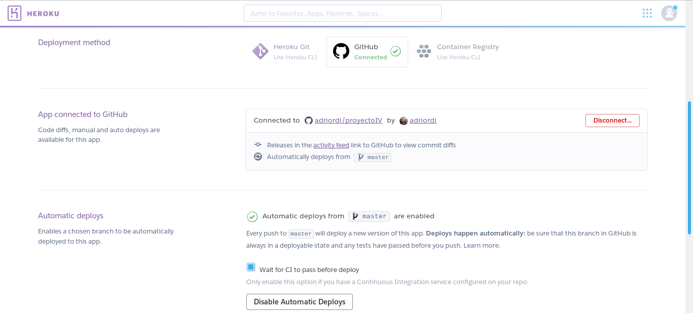

# Despliegue en Heroku

Para poder desplegar mi applicación en Heroku seguí los pasos que se pueden leer en [su documentación](https://devcenter.heroku.com/articles/heroku-cli).

Mi despliegue fue siguiendo los siguientes pasos:

* Instalación

~~~~
curl https://cli-assets.heroku.com/install.sh | sh
yay -S heroku-cli
heroku --version
~~~~

* Login 

~~~~
heroku login
~~~~

* Generación del token

~~~~
heroku auth:token
travis encrypt $(heroku auth:token) --add deploy.api_key
~~~~

* Creación de la applicación y enlace con github

~~~~
heroku create
heroku git:remote -a workwaitqueue
~~~~

* Push de mi applicación a Heroku

~~~~
git push heroku master
~~~~

Después vamos al apartado de configuración de mi aplicación en Heroku y comprobamos que se ha enlazado correctamente nuestro repositorio de GitHub. En el apartado que hay justo debajo, seleccionamos "Enable Automatic deploys" para que cada vez que hagamos un push a la rama master se despliegue una nueva versión, además como es en nuestro caso, seleccionamos la opción "Wait for CI to pass before deploy" ya que tenemos un servicio de integración continua configurado en nuestro repositorio.

Además hay que añadir un archivo Procfile para especificar en él los comandos que serán ejecutados por los dynos gratuitos de Heroku, al usar hug, se debe reemplazar `app` con `__hug_wsgi__`([visto aquí](https://github.com/timothycrosley/hug/issues/308#issuecomment-219351612)). Por último hay que actualizar el fichero [requirements.txt](https://github.com/adriordi/proyectoIV/blob/master/requirements.txt) añadiendo `gunicorn` ya que es el servidor que vamos a usar.

Más información sobre el archivo Procfile [aquí](https://devcenter.heroku.com/articles/procfile)
