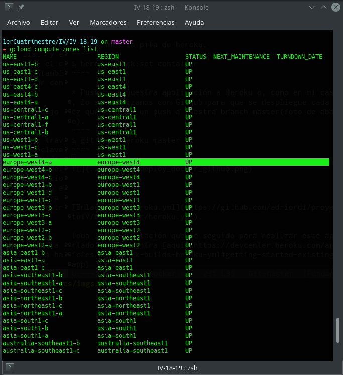
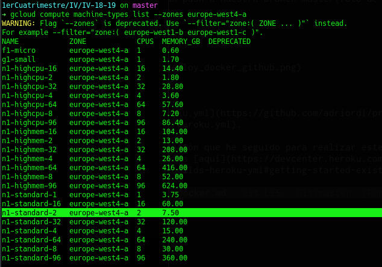
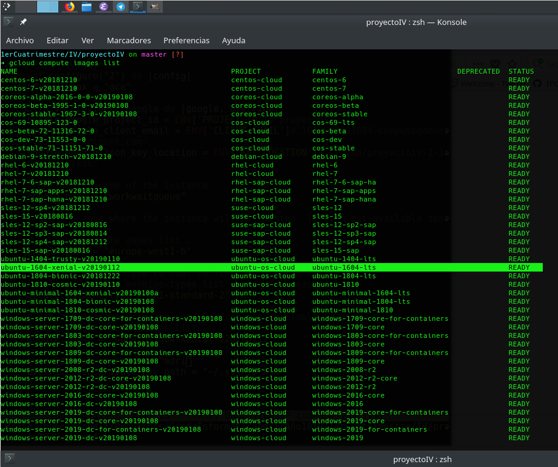
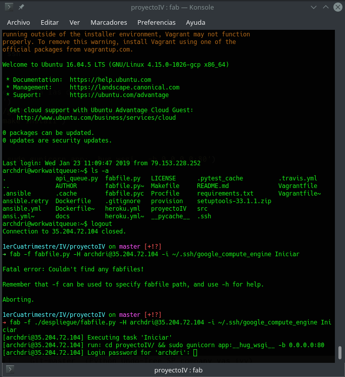
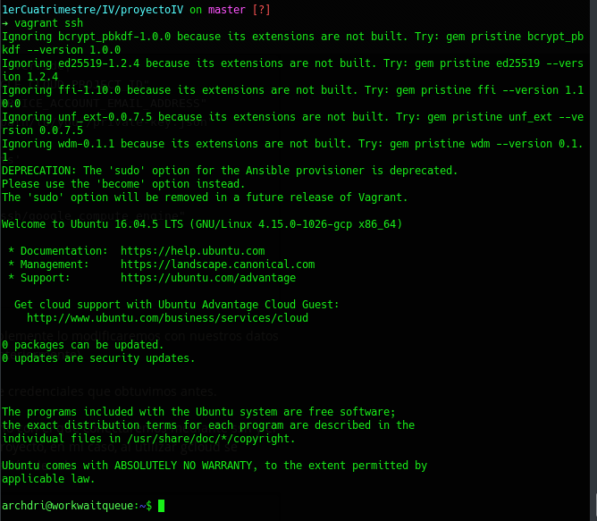
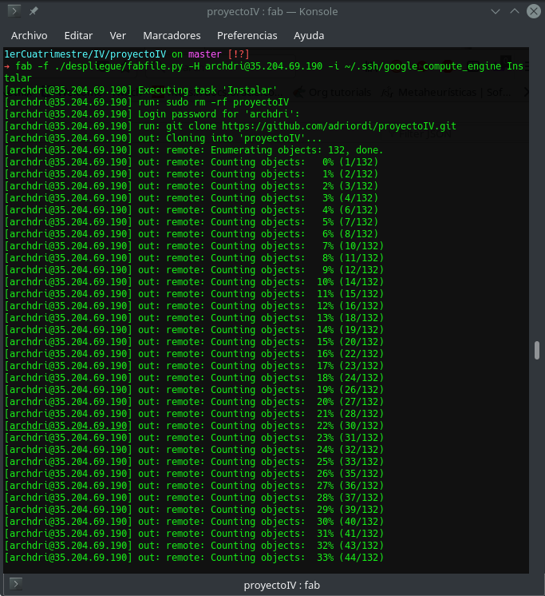
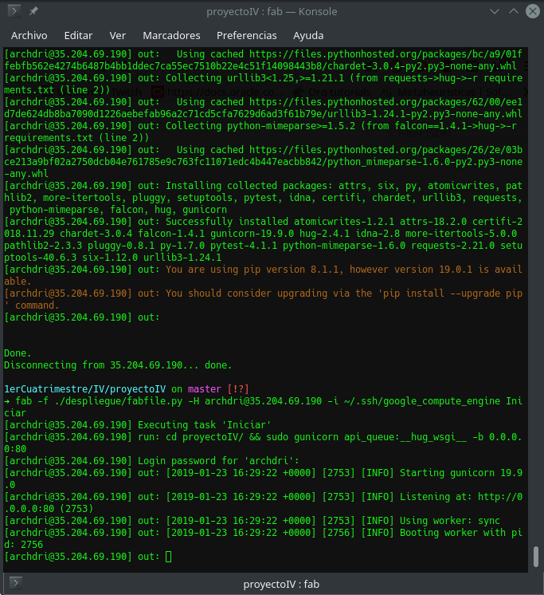
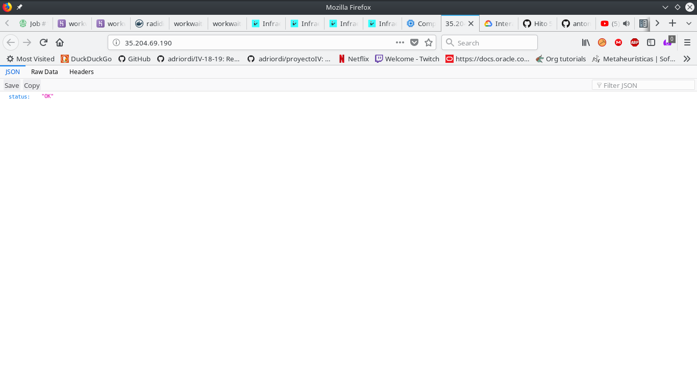

# Despliegue en un IaaS

## Primeros pasos.
Lo primero que hice fue documentarme e logearme en diferentes infraestructuras, al final elegí Google Cloud que nos logeamos con nuestro correo de Gmail y nos da 300$ de crédito gratis para gastar en un año.

## Creación de un proyecto.
Una vez dentro y logeados en nuestra cuenta, nos vamos al apartado **Administrar recursos** y pinchamos en **Crear proyecto**. Elegimos el nombre de nuestro proyecto y su id(el id debemos guardarlo para usarlo después). Terminamos clickando en siguiente y rellenando los campos como nos indican.

## Creación de nuestra instancia y configuración ssh.
Podemos crear una máquina desde la página pero en nuestro caso vamos a usar **vagrant**, lo podemos descargar e instalar desde este [enlace](https://www.vagrantup.com/downloads.html).
Nuestro siguiente paso será la creación del **Vagrantfile** que podemos hacer con el comando `vagrant init`, pero en mi caso a parte del nombre me sirve de poco el que crea.
````shell
# -*- mode: ruby -*-
# vi: set ft=ruby :
Vagrant.configure("2") do |config|
  config.vm.box = "google/gce"

  config.vm.provider :google do |google, override|
    google.google_project_id = "proyectoiv-2"
    google.google_client_email = "adrian@proyectoiv-2.iam.gserviceaccount.com "
    google.google_json_key_location = "~/.ssh/proyectoiv-2-d237bacf85b8.json"

    google.name = "workwaitqueue"
    google.zone = "europe-west4-a"
    google.machine_type = "n1-standard-2"
    google.image = "ubuntu-1604-xenial-v20190112"

    override.ssh.username = "archdri"
    override.ssh.private_key_path = "/home/archdri/.ssh/google_compute_engine"    
  end
  
  # Aprovisionamiento - Ansible
  config.vm.provision "ansible" do |ansible|
    ansible.become = true
    ansible.verbose = "vvvv"
    ansible.playbook = "./provision/playbook.yml"
  end
end
````

Este es [mi Vagrantfile](https://github.com/adriordi/proyectoIV/blob/master/Vagrantfile).
En el cual viene toda la configuración de nuestra máquina virtual, la primera línea es para que coja la box de **Google** sin tener que descargarla específicamente, solamente al levantar nuestra instancia será con el comando `vagrant up --provider=google`.

En las siguientes debemos poner las credenciales, os acordáis del id de antes pues ahora es cuando lo vamos a usar y lo ponemos en `google.google_project_id`, en `google.google_client_email` ponemos el email que obtenemos al crear el json que debemos poner en `google.google_json_key_location`. El email y el json se obtiene en el apartado de **Administración de APIs** -> **Crear credenciales** -> **Clave de cuenta de servicio** -> **JSON**.
El email es el que elegimos y que acaba en **.iam.gserviceaccount.com**.

En las siguientes líneas se define el nombre de la máquina virtual, la zona dónde se encontrará nuestra instancia, elegimos una de las disponibles que se pueden ver con el comando: `gcloud compute zones list`. He elegido la primera que sale de Europa oeste. 




El tipo de máquina virtual, que podemos elegir el que mejor se adapte según veamos con el comando: `gcloud machine-types list --zone (zona elegida anteriormente)`. En mi caso he elegido una máquina que dispone de 2 CPUs y 7,5GB de memoria para tener más que suficiente.




Por último también ponemos la imagen que queramos para nuestra máquina, las disponibles se pueden ver con: `gcloud compute images list`. Al final me decanté por `Ubuntu 16.04 lts` que ya lo he usado anteriormente.





Para poder usar los comandos anteriores se debe instalar el sdk de google cloud que dejo la documentación oficial por [aquí](https://cloud.google.com/sdk/install).

Las dos últimas líneas de mi Vagrantfile, antes de empezar con el aprovisionamiento a través de ansible, es para la conexión por ssh. Antes de explicarlas, hay que añadir la clave  pública que vamos a usar de nuestro par de claves ssh, para ello nos vamos al apartado **Compute Engine** -> **Metadatos** -> **Claves ssh** y añadimos la **clave pública** del par de claves ssh que vamos a utilizar para nuestra conexión. Google cloud nos proporciona por defecto un par de claves que se crean automáticamente y son las que he utilizado en mi caso. Volvemos a mi Vagrantfile para explicar las dos últimas líneas, en la primera debemos poner el usuario por el que vamos a conectarnos y en la segunda el path de nuestra clave privada.

## Aprovisionamiento con ansible.
Siguiendo con el Vagrantfile, debemos añadir principalmente el path a donde se encuentra nuestra receta con `ansible.playbook`, además he añadido una función para que se pueda hacer sudo con `ansible.become = true` y `ansible.verbose` para depurar.

Enlace a mi [playbook](https://github.com/adriordi/proyectoIV/blob/master/provision/playbook.yml)

````yml
---
- name: Provision
  hosts: all
  remote_user: archdri
  become: true

  tasks:

  - name: Update system
    become: true
    command: sudo apt-get update

  - name: Ensure python-apt is installed
    command: >
      apt-get install python-apt -y -q
      creates=/usr/share/doc/python-apt
    become: yes

  - name: Install Python3.6
    become: true
    command: sudo apt-get -y install python3.6

  - name: Install pip
    become: true
    command: sudo apt-get -y install python3-venv python3-pip
    

  - name: Clone my GitHub repository
    git: repo=https://github.com/adriordi/proyectoIV.git dest=proyectoIV/ force=yes

  - name: Install project
    command: make install

  - name: Update system again
    become: true
    command: sudo apt-get update

````

Para realizar este archivo de provisión he leido la [documentación oficial de ansible](https://docs.ansible.com/ansible/latest/user_guide/playbooks.html).
Al principio de este archvio vuelvo a poner el usuario que vamos a conectar por ssh y el `become: true` como he explicado en el apartado anterior además de crear mi archivo de hosts en el path `/etc/ansible/hosts` para añadir todos mis hosts al que se va a conectar. En el archivo pongo `hosts: all` para que pruebe con todos pero se podría poner diferentes grupos de hosts para diferentes recetas de ansible.
Las demás tareas vienen explicadas un poco en el nombre pero básicamente las hago para instalar lo necesario que necesitará mi máquina virtual.

Para instalar ansible, en mi caso lo he realizado con: `pip3 install ansible`

## Despliegue con fabric.
Para instalar fabric: `pip install fabric`.
Creamos un archivo fabfile.py, enlace al [mio](https://github.com/adriordi/proyectoIV/blob/master/despliegue/fabfile.py), en el cual definimos funciones que nos permiten desplegar y administrar nuestro proyecto.

````python
from fabric import *
from fabric.api import *
from fabric.network import ssh


def Instalar():
    "Clona el repositorio e instala las dependencias"
    run('sudo rm -rf proyectoIV')
    run('git clone https://github.com/adriordi/proyectoIV.git')
    run('cd proyectoIV && make install')

def Iniciar():
    "Inicia la aplicacion"
    run('cd proyectoIV/ && sudo gunicorn api_queue:__hug_wsgi__ -b 0.0.0.0:80')

def Parar(): 
    "Parar la ejecución matando el proceso"
    run('sudo kill -9 $(ps -A -o pid,cmd | grep gunicorn | head -n 1 | cut -d " " -f 1)')

def Actualizar():
    "Reinicia la aplicacion y vuelve a ejecutarla"
    Parar()
    Instalar()
    Iniciar()

````

Como se puede ver, dispongo de cuatro funciones que nos van a permitir ejecutar comandos remotamente en nuestra máquina virtual.
En la primera función borramos lo clonado ya en el ansible y lo volvemos a clonar además de hacer `make install` para instalar el proyecto.
En la segunda nos movemos al directorio del proyecto y la desplegamos por el puerto 80 como vemos en la imagenes.
La tercera función es para parar la ejecución matando el proceso de gunicorn y en la última función es una actualización de todo el proceso haciendo primero una llamada a `Parar()`, después a `Instalar()` y por último volvemos a `Iniciar()`. 





Como se observa, me pide la contraseña del usuario archdri para poder realizar el despliegue, esta contraseña no era ninguna por defecto y solo conseguí realizar el despliegue conectandome por ssh con: `vagrant ssh` y configurando una nueva contraseña con: `sudo passwd archdri`




Así que una vez cambiado, ya puedo hacer el despliegue correctamente con el comando: `fab -f ./despliegue/fabfile.py -H archdri@35.204.69.190 -i ~/.ssh/google_compute_engine (funcion del fabfile.py)`











IP donde se puede ver el despliege: [35.204.69.190](http://35.204.69.190/)